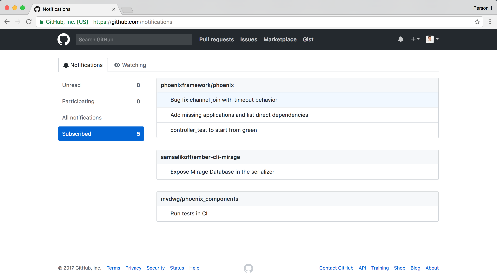

# DEPRECATED

Github implemented this on their own site, which is great!

This extension is not longer needed.

https://github.blog/changelog/2019-03-11-subscription-list/

# Github subscribed

Chrome extension that keeps track of your subscription and show them on github.

## Features
* Works out of the box

## How does it work? 

* When visiting a subscribed thread it will automatically start tracking that thread.
* It attaches to the subscribe button so all new subscribed threads will be tracked.

## What about my old subscriptions, are they added automatically?

They are not... for now.

## Install

[Chrome extension](https://chrome.google.com/webstore/detail/github-subscribed/ckngaeoaloonkgjmgdffjjkifmegkcbb)

## License

github-subscribed is licensed under the MIT license.

See [LICENSE](./LICENSE) for the full license text.
